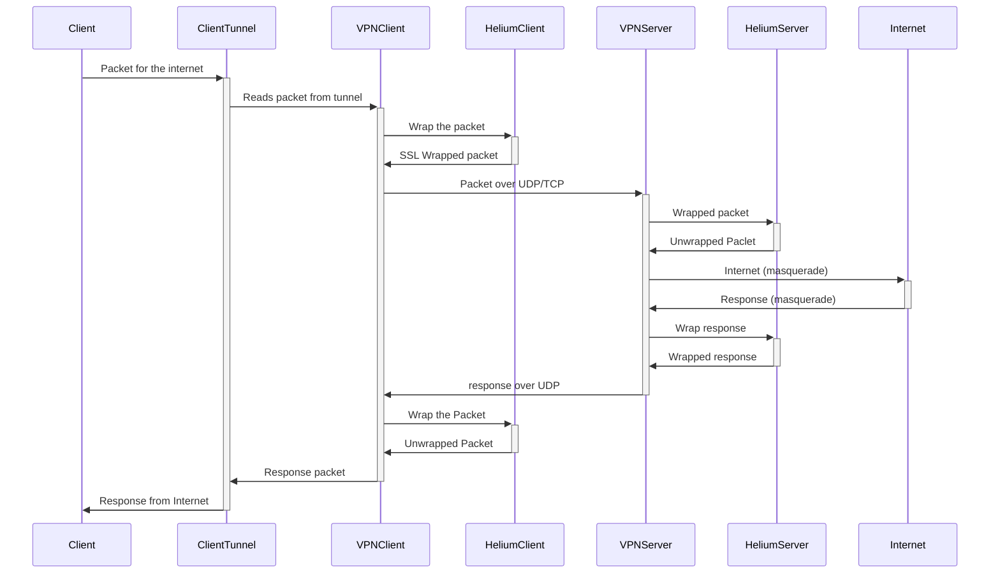

# ToDo

Milestone #1 :

- [ ] Helium server setup with config
- [ ] Helium client setup with config
- [ ] Tunnel setup for server and client
  
- [ ] Testing on mobile network

Milestone #2 :

- [ ] SNI spoofing
- [ ] Testing on LAN network

Milestone #3 :

- [ ] Kernel based offloading and routing research

# Theory

libhelium is a library by ExpressVPN that abstracts away the process of wrapping and unwrappin ssl packed data. This is just one step of the entire process. The user needs to handle the creation and routing of `tun` interface. The user also needs to handle the transport service between the server and the client.

Here is the complete packet flow in the communication :

