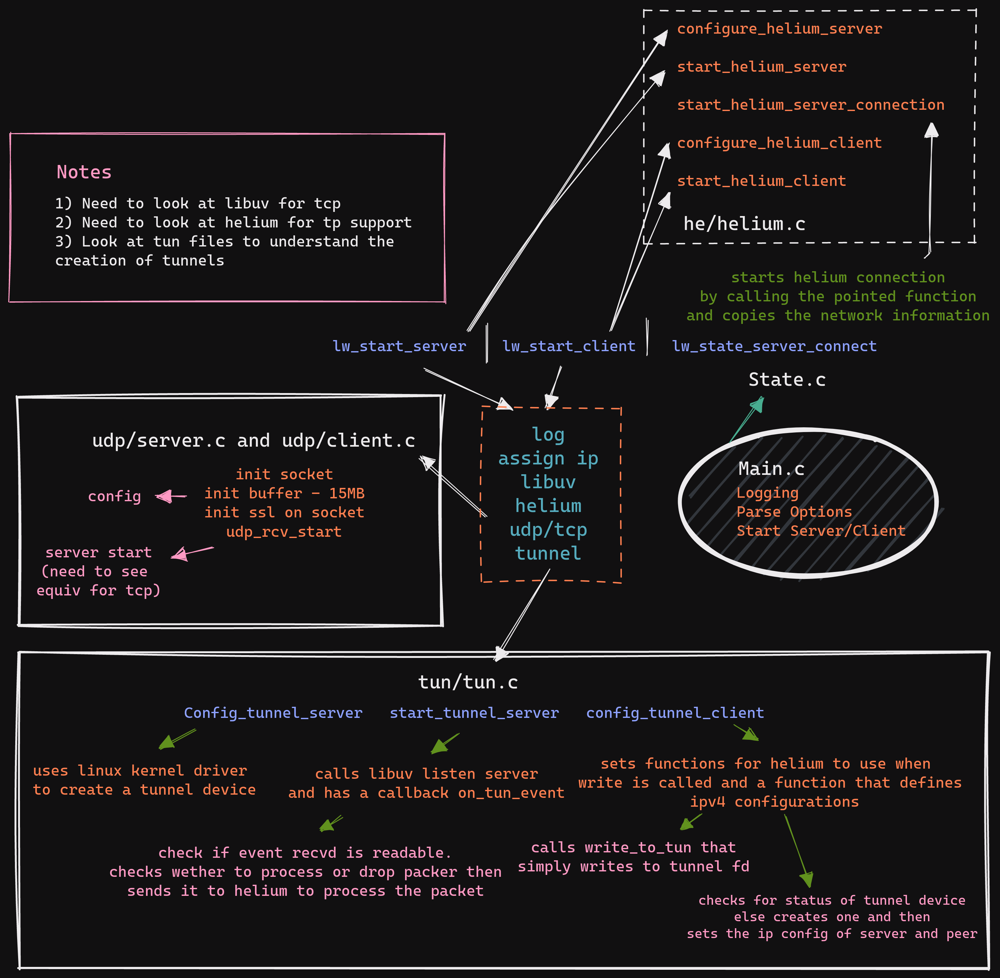

# Lightway-Laser

It is a codebase released by ExpressVPN as a model to use their `lightway-core` api to enable users to create their own lightweight vpn. They have only implemented UDP server/client ([availabe here](https://github.com/expressvpn/lightway-laser/)) which does not work at my institute. So I will be implementing TCP part.

## Working of lightway-laser

This is what I could make of the API yet. I will update the information as I begin to understand more.

Image Credits : Me 😅

## Progress

- [X] Understand lightway-laser working
- [ ] Undesrtand libuv to implement tcp
- [X] Undesratnd libhelium (also known as lightway-core)
- [ ] Write an implementation of the vpn
- [ ] Test on server
- [ ] Write complete documentation

Routing information at [route.md](./route.md) - normal and openvpn connections 
Expressvpn diagnostics at [express-diagnostic.md](./express-diagnostic.md)

More updates soon!
